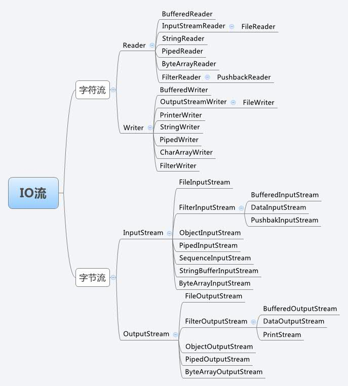

### JavaSE 高级 之 IO

- Java中有几种类型的流？

```markdown
按照类型来分
- 字节流
- 字符流

按照流的方向
- 输入流
- 输出流

按照功能分
- 节点流
- 处理流
```

- 请画出字符流和字节流的继承体系



- 字节流如何转为字符流

```java
// OutputStreamWriter类
// 查阅OutputStreamWriter的API介绍，OutputStreamWriter 是字符流通向字节流的桥梁：
// 可使用指定的字符编码表，将要写入流中的字符编码成字节。它的作用的就是，
// 将字符串按照指定的编码表转成字节，在使用字节流将这些字节写出去。
// 代码演示

public static void writeCN() throws Exception {
    //创建与文件关联的字节输出流对象
    FileOutputStream fos = new FileOutputStream("c:\\cn8.txt");
    //创建可以把字符转成字节的转换流对象，并指定编码
    OutputStreamWriter osw = new OutputStreamWriter(fos,"utf-8");
    //调用转换流，把文字写出去，其实是写到转换流的缓冲区中
    osw.write("你好");//写入缓冲区。
    osw.close();
}

// OutputStreamWriter流对象，它到底如何把字符转成字节输出的呢？
// 其实在OutputStreamWriter流中维护自己的缓冲区，当我们调用OutputStreamWriter对象的write方法时，
// 会拿着字符到指定的码表中进行查询，把查到的字符编码值转成字节数存放到OutputStreamWriter缓冲区
//中。然后再调用刷新功能，或者关闭流，或者缓冲区存满后会把缓冲区中的字节数据使用字节流写到指定的文件中。

// InputStreamReader类
// 查阅InputStreamReader的API介绍，InputStreamReader 是字节流通向字符流的桥梁：
// 它使用指定的字符编码表读取字节并将其解码为字符。它使用的字符集可以由名称指定或显式给定，或者可以接受平台默认的字符集。

// 代码演示
public static void main(String[] args) throws IOException {
    //演示字节转字符流的转换流
    readCN();
}
public static void readCN() throws IOException{
    //创建读取文件的字节流对象
    InputStream in = new FileInputStream("c:\\cn8.txt");
    //创建转换流对象 
    //InputStreamReader isr = new InputStreamReader(in);
    //这样创建对象，会用本地默认码表读取，将会发生错误解码的错误
    InputStreamReader isr = new InputStreamReader(in,"utf-8");
    //使用转换流去读字节流中的字节
    int ch = 0;
    while((ch = isr.read())!=-1){
        System.out.println((char)ch);
    }
    //关闭流
    isr.close();
}

// 注意：在读取指定的编码的文件时，一定要指定编码格式，否则就会发生解码错误，而发生乱码现象。
```

- 如何将一个Java对象序列化到文件里

  ```java
  // 模拟数据库的增删改查
  public class User implements Serializable {
      private Integer id;
      private String name;
      private String password;
  
      // 省略Get 和 Set
  }
  
  
  // 核心代码
  public class ObjectOutDemo {
      private static String dbName = "User.ic";
      private static String path = "src\\cn\\icanci\\day0812\\ic_db";
  
      public static void main(String[] args) {
          ArrayList<User> users = new ArrayList<>();
          for (int i = 0; i < 10; i++) {
              users.add(new User(i, "ic" + i, "pwd" + i));
          }
          save(users, path, dbName);
          ArrayList<User> readUsers = new ArrayList<>();
          List<User> listNew = readDb(path, dbName, readUsers);
          listNew.forEach(System.out::println);
          deleteById(path, dbName, 1);
          listNew = readDb(path, dbName, readUsers);
          System.out.println("=================");
          listNew.forEach(System.out::println);
  
      }
  
      /**
       * 读取数据到 内存
       *
       * @param path
       * @param dbName
       * @param list
       * @return
       */
      public static List<User> readDb(String path, String dbName, List<User> list) {
          ObjectInputStream in = null;
          try {
              in = new ObjectInputStream(new FileInputStream(path + "\\" + dbName));
              list = (List<User>) in.readObject();
              return list;
          } catch (Exception e) {
              e.printStackTrace();
          } finally {
              if (null != in) {
                  try {
                      in.close();
                  } catch (IOException e) {
                      e.printStackTrace();
                  }
              }
          }
          return list;
      }
  
      /**
       * 保存数据到内存
       *
       * @param list
       * @param path
       * @param dbName
       */
      public static void save(List<User> list, String path, String dbName) {
          if (null == list) {
              throw new NullPointerException("输出的list不能为null");
          }
          ObjectOutputStream out = null;
          try {
              ArrayList<User> temp = new ArrayList<>();
              List<User> users = readDb(path, dbName, temp);
              if (null == users) {
                  out = new ObjectOutputStream(new FileOutputStream(path + "\\" + dbName));
                  out.writeObject(list);
                  System.out.println("数据保存成功");
                  return ;
              }
              for (User user : list) {
                  users.add(user);
              }
              out = new ObjectOutputStream(new FileOutputStream(path + "\\" + dbName));
              out.writeObject(users);
              System.out.println("数据保存成功");
          } catch (Exception e) {
              e.printStackTrace();
          } finally {
              if (null != out) {
                  try {
                      out.close();
                  } catch (IOException e) {
                      e.printStackTrace();
                  }
              }
          }
      }
  
      /**
       * 根据id删除
       *
       * @param path
       * @param dbName
       * @param id
       */
      public static void deleteById(String path, String dbName, Integer id) {
          ArrayList<User> users = new ArrayList<>();
          List<User> list = readDb(path, dbName, users);
          Iterator<User> iterator = list.iterator();
          while (iterator.hasNext()) {
              User next = iterator.next();
              if (id.equals(next.getId())) {
                  iterator.remove();
              }
          }
          save(list, path, dbName);
      }
  
      /**
       * 添加一个元素
       *
       * @param path
       * @param dbName
       * @param user
       */
      public static void insert(String path, String dbName, User user) {
          ArrayList<User> users = new ArrayList<>();
          List<User> users1 = readDb(path, dbName, users);
          users1.add(user);
          save(users1, path, dbName);
      }
  }
  
  ```

  - 知道克隆吗？

  ```markdown
  Java提供了Cloneable接口，实现Cloneable接口的类可以被克隆
  Java提供的克隆是浅克隆
  可以通过重写类的 clone 方法 来实现深度克隆
  @Override
  protected Object clone() throws CloneNotSupportedException {
  	return super.clone();
  }
  
  也可以使用序列化来实现深度克隆
  ```

- 字节流和字符流的区别

```
字符流主要用来处理字符
字节流主要用于处理二进制

注意：字节流可以处理任何文件，但是字符流不一定
```

- 什么是Java序列化，如何实现Java序列化

```markdown
Java序列化就是类可以转化为文件保存、在网络上传输
Java的序列化类，必须实现 Serializable 接口，这是一个标记接口
实现序列化的方式在上文的代码已经做出实例
```

- 既然有了字节流，为什么还要有字符流？

```markdown
字符流是由JVM将字节转换得到的，所以这个过程还是非常耗时的，同样假如我们不知道编码方式就很容易出现乱码的问题，所以I/O流就干净利索的提供了一个直接操作字符的接口，方便我们平时对字符进行流操作。当然图片和音频这些文件我们还是用字节流比较好。涉及到字符的我们就使用字符流比较好。
```

- BIO、NIO、AIO有什么区别 **此部分参考学习文章： https://zhuanlan.zhihu.com/p/51453522** 
  - BIO
    - 就是传统的**java.io**包
  - NIO
    - 是 java1.4 引入的 **java.nio** 包
  - AIO
    - 是java7引入的包，是NIO的升级版本