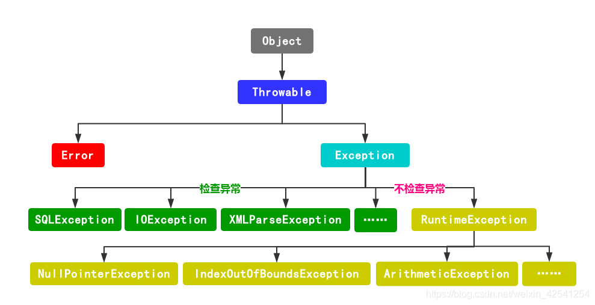
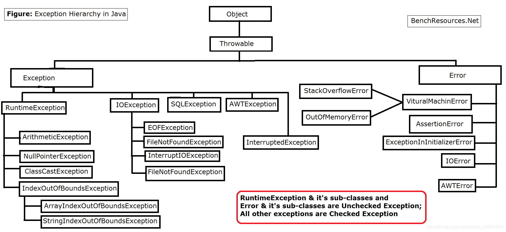

### JavaSE 高级 之 异常

- 什么是异常
  - Java中的异常（Exception）又称为例外，是一个在程序执行期间发生的事件，它中断正在执行程序的正常指令流。为了能够及时有效的处理程序中的运行错误，必须使用异常类。
  - 在Java程序中，错误可能产生于程序员没有预料到的情况，或者超出程序员可控制的范围。

- 请画出异常的继承体系图

  - 图片源于： https://blog.csdn.net/weixin_42541254/article/details/102226691 





- Error错误和Exception

  - Error错误是系统级别的报错，是程序无法处理的
  - Exception异常包括编译时异常和运行时异常
    - 编译时异常是程序认为此段代码可能会出问题，所以提前拿出来
    - 运行时异常指的是在程序运行过程中出现的异常

- Throwable类常用的方法有哪些？

  ```java
  // 获取异常的信息
  public String getMessage() {
      return detailMessage;
  }
  
  // 获取异常的原因
  public String getLocalizedMessage() {
      return getMessage();
  }
  
  // 返回当前异常是否是指定的异常，如果不是就返回null
  public synchronized Throwable getCause() {
      return (cause==this ? null : cause);
  }
  
  // 打印异常信息
  public void printStackTrace() {
      printStackTrace(System.err);
  }
  
  // toString() 方法
  public String toString() {
      String s = getClass().getName();
      String message = getLocalizedMessage();
      return (message != null) ? (s + ": " + message) : s;
  }
  ```

- try-catch-finally 的使用 
  - JDK7之后 try-catch-finally的新特性是什么？
  
    > 可以在try(资源1,资源2){}catch{} 的 () 中释放异常
  
  - 在哪些情况下,finally不会执行？
  
    - 在finally块执行之前退出程序 `System.exit(1)`
  
    ```java
    public class ExceptionDemo {
        public static void main(String[] args) {
            try {
                int i = 1 / 0;
            } catch (Exception e) {
                e.printStackTrace();
                System.out.println(e.getLocalizedMessage());
                System.exit(1);
            } finally {
                System.out.println("ExceptionDemo.main");
            }
        }
    }
    
    ```
  
    - 在finally块的第一句就是退出程序，则剩下的finally块不会执行
  
    ```java
    public class ExceptionDemo {
        public static void main(String[] args) {
            try {
                int i = 1 / 0;
            } catch (Exception e) {
                e.printStackTrace();
                System.out.println(e.getLocalizedMessage());
            } finally {
                System.exit(1);
                System.out.println("ExceptionDemo.main");
            }
        }
    }
    
    ```
  
    - 在finally块的第一行出现异常
  
    ```java
    public class ExceptionDemo {
        public static void main(String[] args) {
            try {
                int i = 1 / 0;
            } catch (Exception e) {
                e.printStackTrace();
                System.out.println(e.getLocalizedMessage());
            } finally {
                int i = 1 / 0;
                System.out.println("ExceptionDemo.main");
            }
        }
    }
    
    ```
  
    - **注意：此处所说的 System.exit() 并不是一定会执行，如下列代码，执行执行了System.exit(1)之后，程序会直接退出，如下代码**
  
    ```java
    public class ExceptionDemo {
        public static void main(String[] args) {
            try {
                int i = 1 / 0;
                System.exit(1);
            } catch (Exception e) {
                e.printStackTrace();
                System.out.println(e.getLocalizedMessage());
            } finally {
                System.out.println("ExceptionDemo.main");
            }
        }
    }
    ```
  
    
  
- 请说出你在学习或者开发中遇到的异常

  - 编译期异常	
    - IO 系列异常
    - ClassNotFoundException
    - XMLParseException
    - SQLException
    - InterruptedException
  - 运行时异常
    - ArithmeException
    - ClassCastException
    - IllegalArgumentException
    - IndexOutOfBoundException
    - NullPointerException
    - DateTimeException

- 如何自定义异常

```java
// 1. 创建一个类
// 2. 继承 Exception
// 3. 生成构造方法、重写方法即可

public class MyException extends Exception{

    public MyException() {
    }

    public MyException(String message) {
        super(message);
    }

    public MyException(String message, Throwable cause) {
        super(message, cause);
    }

    public MyException(Throwable cause) {
        super(cause);
    }

    public MyException(String message, Throwable cause, boolean enableSuppression, boolean writableStackTrace) {
        super(message, cause, enableSuppression, writableStackTrace);
    }

    @Override
    public String getMessage() {
        return "别胡扯异常";
    }
}

// ----------------------------------------------------------------------------------

public class MyException2 extends Throwable{
    public MyException2() {
    }

    public MyException2(String message) {
        super(message);
    }

    public MyException2(String message, Throwable cause) {
        super(message, cause);
    }

    public MyException2(Throwable cause) {
        super(cause);
    }

    public MyException2(String message, Throwable cause, boolean enableSuppression, boolean writableStackTrace) {
        super(message, cause, enableSuppression, writableStackTrace);
    }

    @Override
    public String getMessage() {
        return "第二个别胡扯异常";
    }
}

```

```java
// 测试

public class TestMyException {
    public static void main(String[] args) throws MyException2{
        try {
            if (10 > 0) {
                throw new MyException2("eeee");
            }
        } catch (MyException e) {
            e.printStackTrace();
        }
    }
}

```

- 异常的作用是什么 
  - 提高软件的交互性 
  - 定位出错位置，方便程序员后期排查错误
  - 异常跟普通的警告等有一定的区别。当应用程序发生异常时，会中断正在执行的程序的正常指令流。也就是说，发生异常后面的代码将得不到正确的执行。甚至还会触发数据库的回退操作。异常是保证应用程序正常运行的前提。 
  - 在后期的Spring事务中，异常可以触发事务的回退

- 请说出常见的ＯＯＭ异常
  - 在什么情况下会发生这样的异常？这里先做一下简单的的介绍，具体的场景将在 `Java面试知识宝典 - JVM.md`详细讲解
  - 常见的OOM 
    - java.lang.StackOverflowError
    - java.lang.OutOfMemoryError: Java heap space
    - java.lang.OutOfMemoryError: GC overhead limit exceeded
    - java.lang.OutOfMemoryError-->Metaspace
    - java.lang.OutOfMemoryError: Direct buffer memory
    - java.lang.OutOfMemoryError: unable to create new native thread
    - java.lang.OutOfMemoryError：Metaspace
    - java.lang.OutOfMemoryError: Requested array size exceeds VM limit
    - java.lang.OutOfMemoryError: Out of swap space
    - java.lang.OutOfMemoryError：Kill process or sacrifice child