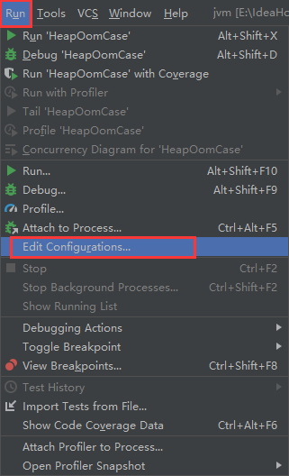
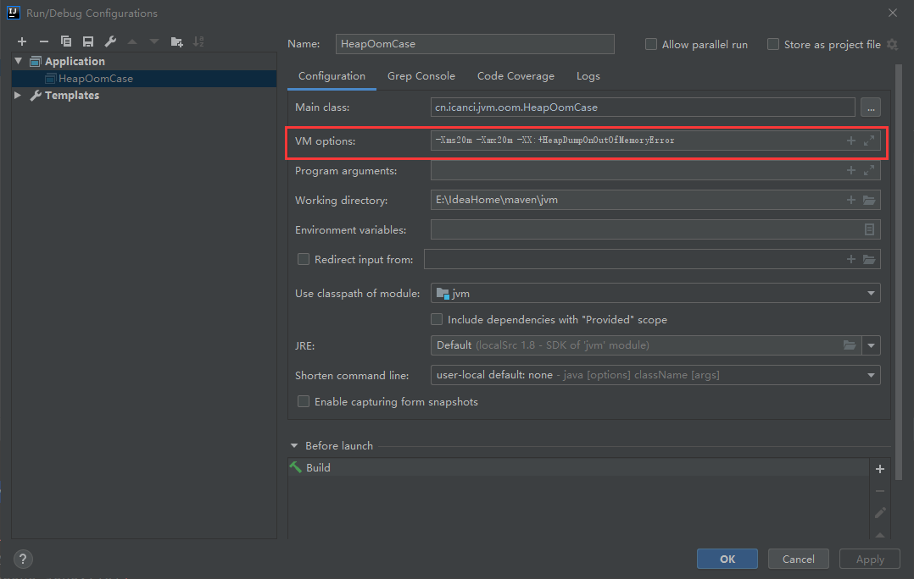
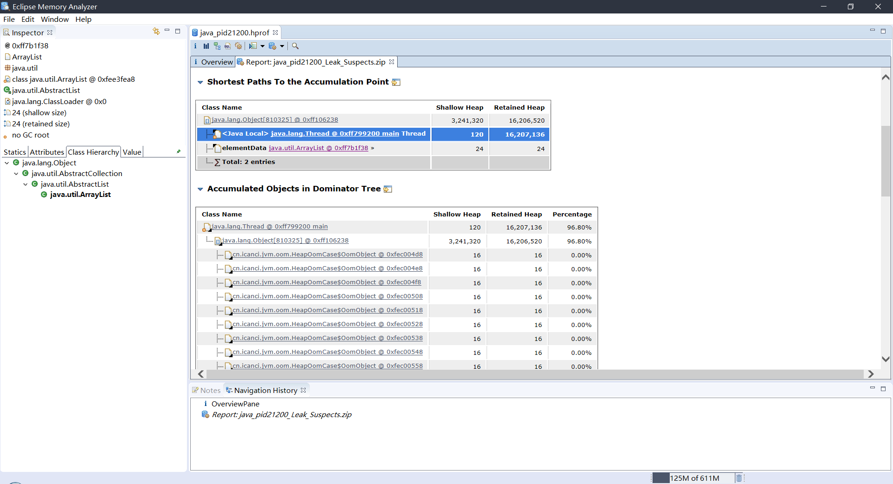
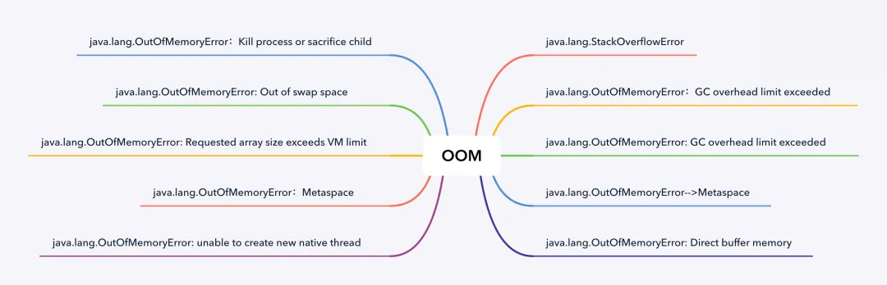
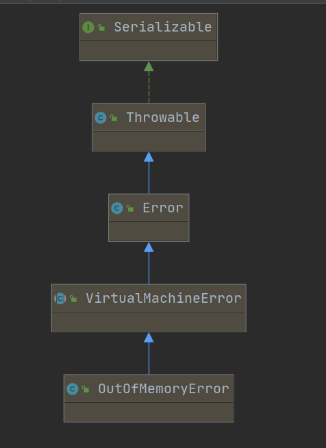
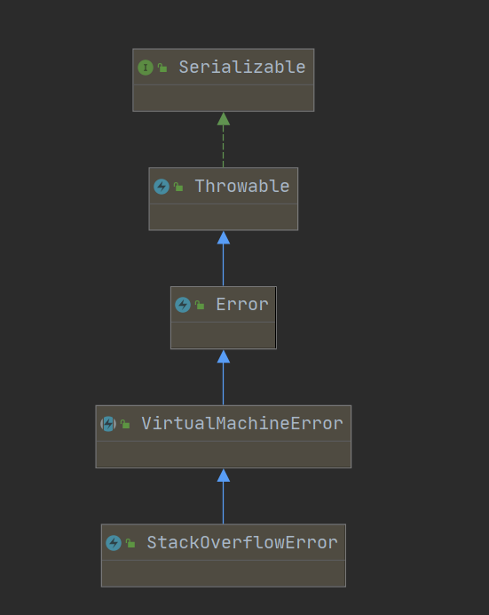
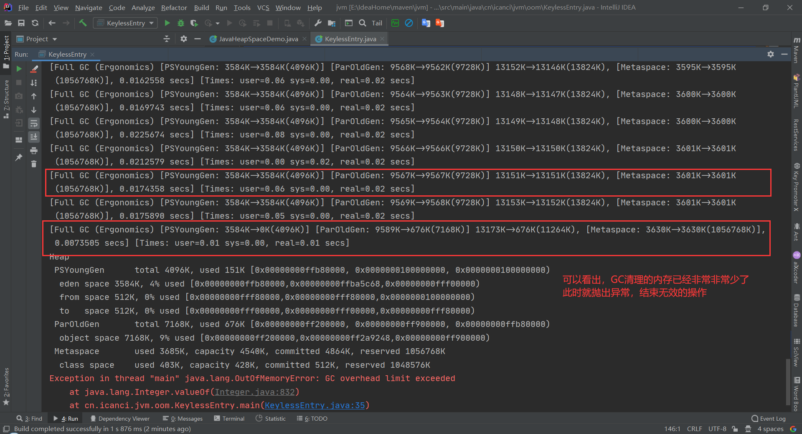
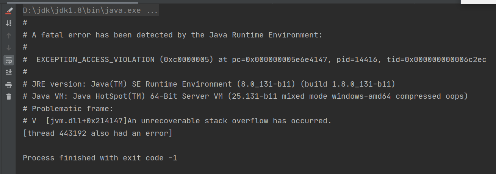
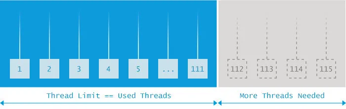
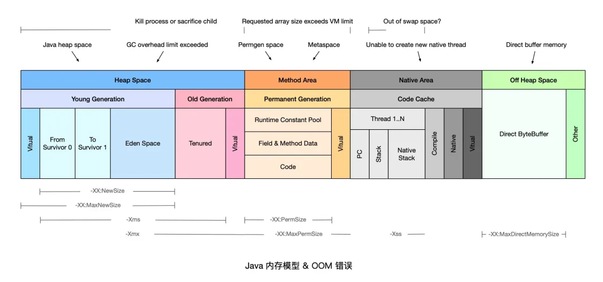

### Java - 异常 - 进阶 - OOM异常

**OOM异常全称为：OutOfMemoryError**，是Java异常中相等常见，但是很多人不知道的异常

- 本篇将全面讲解OOM异常

#### Java堆溢出

- Java堆用来存储对象实例，我们只要不断地创建对象，并且保证GC Roots到对象之间有可达路径来避免垃圾回收机制清除这些对象，那么随着对象数量的增加，总容量触及最大堆的容量之后就会发生内存溢出异常

**调整虚拟机参数，否则执行时间太长：IDEA**





**代码清单**

```java
/**
 * @Author: icanci
 * @ProjectName: jvm
 * @PackageName: cn.icanci.jvm.oom
 * @Date: Created in 2020/8/1 7:59
 * @ClassAction: 堆溢出异常
 *
 * VM args: -Xms20m -Xmx20m -XX:+HeapDumpOnOutOfMemoryError
 */
public class HeapOomCase {
    static class OomObject {

    }

    public static void main(String[] args) {
        ArrayList<OomObject> list = new ArrayList<>();
        while (true) {
            list.add(new OomObject());
        }
    }
}

```

**运行结果**

```text
java.lang.OutOfMemoryError: Java heap space
Dumping heap to java_pid21200.hprof ...
Heap dump file created [28243619 bytes in 0.081 secs]
Exception in thread "main" java.lang.OutOfMemoryError: Java heap space
	at java.util.Arrays.copyOf(Arrays.java:3210)
	at java.util.Arrays.copyOf(Arrays.java:3181)
	at java.util.ArrayList.grow(ArrayList.java:261)
	at java.util.ArrayList.ensureExplicitCapacity(ArrayList.java:235)
	at java.util.ArrayList.ensureCapacityInternal(ArrayList.java:227)
	at java.util.ArrayList.add(ArrayList.java:458)
	at cn.icanci.jvm.oom.HeapOomCase.main(HeapOomCase.java:20)

Process finished with exit code 1
```

- Java堆栈内存的OutOfMemoryError异常是在实际应用场景中中最常见的内存溢出异常情况。

- 要解决这个异常，常规的处理方法就是使用内存映像分析工具多Dump的堆转存快照进行分析（Eclipse Memory Analyzer）

- 第一步应该确认内存中导致OOM的对象是否是必要的，也就是要先分析出到底是出现了内存泄漏还是内存溢出

- 下图显示了使用 Eclipse Memory Analyzer 打开的堆转储快照文件



- 如果是内存泄漏，可进一步通过工具查看泄漏对象到GC Roots的引用链，找到泄漏对象是通过怎样的引用路径、与哪些GC Roots 相关联，才导致垃圾回收器无法回收它们。根据泄漏对象的类型信息以及它到GC Roots引用链的信息，一般可以比较准确的定位到这些对象创建的位置，进而找到产生内存泄漏的代码的具体位置。

- 如果不是内存泄漏，换句话说就是内存中的对象确实都是必须存活的，那就有应当检查Java虚拟机的堆参数和（-Xmx -Xms）设置，与机器内存相比，看看是否还有向上调整的空间。再从代码上检查是否存在某些对象声明周期过长、持有状态过长、存储结构设计不合理的情况，尽量减少程序运行时期的内存消耗

#### 虚拟机栈和本地方法栈溢出

- 由于Java虚拟机并不区分虚拟机栈和本地方法栈，因此对于JVM来说 设置 -Xoss虽然存在，但是没有意义的。栈容量只能由 -Xss来设置

- 关于虚拟机栈和本地方法栈，JVM提供了两种异常

  - 如果线程请求的栈深度大于虚拟机锁允许的最大深度，将抛出 `StackOverflowError`异常
  - 如果虚拟机的栈内存允许动态扩展，当扩展栈容量无法申请到足够的内存的时候，将抛出 `OutOfMemoryError` 异常

- 《Java虚拟机规范》明确允许Java虚拟机实现自行选择是否支持栈的动态扩展，而HotSpot虚拟机的选择是不支持扩展，除非是在创建线程的过程中申请内存的时候就因无法获得足够内存而出现 `OutOfMemoryError`异常，否则线程运行的时候是不会因为扩展而导致内存溢出的，只会因为栈容量无法容纳新的栈帧而导致 `StackOverflowError`异常

- 在单线程情况下实验

  - 使用 -Xss 参数减少栈内存的容量
    - 结果：抛出 `StackOverflowError`异常
  - 定义了大量的本地变量，增大此方法栈本地变量表的长度
    - 结果：抛出`StackOverflowError`异常

  ```java
  /**
   * 使用 -Xss 参数减少栈内存的容量
   *
   * VM：-Xss128k
   *
   * @author icanci
   */
  public class JavaVMStackSOF {
      private int stackLength = 1;
  
      public static void main(String[] args) {
          JavaVMStackSOF oom = new JavaVMStackSOF();
          try {
              oom.stackLeak();
          } catch (Throwable e) {
              System.out.println("stackLength:" + oom.stackLength);
              throw e;
          }
      }
  
      public void stackLeak() {
          stackLength++;
          stackLeak();
      }
  }
  
  // 输出结果
  // stackLength:1285
  // Exception in thread "main" java.lang.StackOverflowError
  ```

  - 不同版本的JVM虚拟机和不同的操作系统深度可能不同

  ```java
  /**
   * VM：-Xss128k
   *
   * @author icanci
   */
  public class JavaVMStackSOF {
      private int stackLength = 1;
  
      public static void main(String[] args) {
          JavaVMStackSOF oom = new JavaVMStackSOF();
          try {
              oom.test();
          } catch (Throwable e) {
              System.out.println("stackLength:" + oom.stackLength);
              throw e;
          }
      }
  
      public void test() {
          long a0, a1, a2, a3, a4, a5, a6, a7, a8, a9, a10, a11, a12, a13, a14, a15, a16, a17, a18, a19,
                  a20, a21, a22, a23, a24, a25, a26, a27, a28, a29,
                  a30, a31, a32, a33, a34, a35, a36, a37, a38, a39,
                  a40, a41, a42, a43, a44, a45, a46, a47, a48, a49,
                  a50, a51, a52, a53, a54, a55, a56, a57, a58, a59,
                  a60, a61, a62, a63, a64, a65, a66, a67, a68, a69,
                  a70, a71, a72, a73, a74, a75, a76, a77, a78, a79,
                  a80, a81, a82, a83, a84, a85, a86, a87, a88, a89,
                  a90, a91, a92, a93, a94, a95, a96, a97, a98, a99;
          stackLength++;
          test();
          a0 = a1 = a2 = a3 = a4 = a5 = a6 = a7 = a8 = a9 = a10 = a11 = a12 = a13 = a14 = a15 = a16 = a17 = a18 = a19 =a20 = a21 = a22 = a23 = a24 = a25 = a26 = a27 = a28 = a29 = a30 = a31 = a32 = a33 = a34 = a35 = a36 = a37 = a38 = a39 = a40 = a41 = a42 = a43 = a44 = a45 = a46 = a47 = a48 = a49 = a50 = a51 = a52 = a53 = a54 = a55 = a56 = a57 = a58 = a59 = a60 = a61 = a62 = a63 = a64 = a65 = a66 = a67 = a68 = a69 = a70 = a71 = a72 = a73 = a74 = a75 = a76 = a77 = a78 = a79 = a80 = a81 = a82 = a83 = a84 = a85 = a86 = a87 = a88 = a89 = a90 = a91 = a92 = a93 = a94 = a95 = a96 = a97 = a98 = a99 = 0;
      }
  }
  
  // 输出结果
  // stackLength:52
  // Exception in thread "main" java.lang.StackOverflowError
  ```

  - 从次数我们就可看出，二者不是同一个问题导致的
  - 所以我们可以知道，无论是因为栈帧太大还是虚拟机栈容量太小，当新的栈帧内存无法分配的时候，HotSpot虚拟机抛出的是 `StackOverflowError` 异常 ，如果是在可以无线增加大小的虚拟机上，则会抛出异常 `OutOfMemoryError`

- 创建线程导致内存溢出异常

```java
/**
 * 我自己的电脑死机了
 * VM：-Xss2M
 *
 * @author icanci
 */
public class JavaVMStackSOF {
    private int stackLength = 1;

    public static void main(String[] args) {
        JavaVMStackSOF oom = new JavaVMStackSOF();
        try {
            oom.stackLeakByThread();
        } catch (Throwable e) {
            System.out.println("stackLength:" + oom.stackLength);
            throw e;
        }
    }

    private void dontStop() {
        while (true) {

        }
    }

    public void stackLeakByThread() {
        while (true) {
            new Thread(() -> {
                dontStop();
            }).start();
        }
    }
}

// 结果
// 根据《深入了解Java虚拟机 第三版》报错信息 应该如下
// Exception in thread "main" java.lang.OutOfMemoryError: unable to create native thread
```

- 出现 `StackOverflowMemoryError`异常的时候，会有明确的错误堆栈可供分析，相对比较容易得到问题的解决。

#### 方法区和运行时常量池溢出

- 由于运行时常量池是方法区的一部分，所以这两个区域的溢出测试可以放在一起测试。

- 下面的代码在JDK6之前版本才能出现指定的异常

```java
/**
 * VM:-XX:PermSize=6M -XX:MaxPermSize=6M
 */
public class RuntimeConstPoolOom {
    public static void main(String[] args) {
        // 使用set保持常量池引用 避免 Full GC 回收
        HashSet<String> set = new HashSet<>();
        short i = 0;
        while (true) {
            set.add(String.valueOf(i).intern());
        }
    }
}

// Exception in thread "main" java.lang.OutOfMemaryError: PermGen space
// at java.lang.String.intern(Native Method)
```

- 方法区异常也是一种常见的异常，一个类如果需要被垃圾回收机器回收，要达成的条件是十分苛刻的。在经常运行时生成大量动态类的应用常见里面，就应该特别关心这些类的回收情况。
- 在Java8之后，永久代完全退出了历史。元空间作为其替代者登场。
- HotSpot提供了一些关于元空间的调整参数
  - -XX:MaxMetaspaceSize 设置元空间的最大值，默认时-1，即不限制，或者说只受本地内存的大小
  - -XX:MetaspaceSize 指定元空间的初始大小，以字节为单位 ，达到改值的时候就会触发GC，同时GC会对该值进行调整：如果释放了大量的空间，就适当降低该值，如果释放了很少的空间，那么在不超过 -XX:MaxMetaspaceSize（如果设置了），适当提高该值
  - -XX:MinMetaspaceFreeRatio 作用是在垃圾回收之后控制最小的元空间剩余容量的百分比，可减少因为元空间不足导致垃圾收集的频率。类似的还有 -XX:MaxMetaspaceFreeRatio，用于控制最大元空间剩余容量的百分比

#### 本机直接内存溢出

- 直接内存（Direct Memory）的容量大小可通过 -XX:MaxDiretMemorySize 参数来指定，如果不指定，就和默认的Java堆的最大值（-Xmx）一致
- 下面写一些代码用来演示直接越过 DirectByteBuffer 去直接调用Unsafe的方法，真正抛出异常的是 Unsafe::allocateMemory()

```java
/**
 * 我设置参数的时候，保持虚拟机干不起来，删除就可以了 报错如下
 *
 * VM: -Xmx:20M -XX:MaxDirectMemorySize=10M
 *
 * Error: Could not create the Java Virtual Machine.
 * Error: A fatal exception has occurred. Program will exit.
 * Invalid maximum heap size: -Xmx:20M
 */

public class DirectMemoryOom {
    private static final int _1MB = 1024 * 1024;

    public static void main(String[] args) throws Exception {
        Field unsafeField = Unsafe.class.getDeclaredFields()[0];
        unsafeField.setAccessible(true);
        Unsafe unsafe = (Unsafe) unsafeField.get(null);
        while (true) {
            unsafe.allocateMemory(_1MB);
        }
    }
}

// 报错如下
// Exception in thread "main" java.lang.OutOfMemoryError
// at sun.misc.Unsafe.allocateMemory(Native Method)
// at cn.icanci.jvm.oom.DirectMemoryOom.main(DirectMemoryOom.java:30)
```

- 由直接内存导致的内存溢出，一个明显的特征是Heap Dump 文件中不会看到有什么明显的异常情况。

#### OOM异常类型分析 - 补充

- 在《Java虚拟机规范》的规定里，除了程序计数器外，虚拟机内存的其他几个运行时区域都有发生 OutOfMemoryError 异常的可能。 


**本篇主要包括如下 OOM 的介绍和示例：**

- java.lang.StackOverflowError
- java.lang.OutOfMemoryError: Java heap space
- java.lang.OutOfMemoryError: GC overhead limit exceeded
- java.lang.OutOfMemoryError-->Metaspace
- java.lang.OutOfMemoryError: Direct buffer memory
- java.lang.OutOfMemoryError: unable to create new native thread
- java.lang.OutOfMemoryError：Metaspace
- java.lang.OutOfMemoryError: Requested array size exceeds VM limit
- java.lang.OutOfMemoryError: Out of swap space
- java.lang.OutOfMemoryError：Kill process or sacrifice child

> 我们常常说的OOM异常，其实是Error






#### StackOverflowError

```java
public class StackOverflowErrorDemo {
    public static void main(String[] args) {
        javaKeeper();
    }

    private static void javaKeeper() {
        javaKeeper();
    }
}
```

- 在上面的案例中我们已经发现，JVM虚拟机栈是有深度的，执行方法的时候会伴随这入栈和出栈，main方法不停的递归，会将栈撑爆。
- 报错异常信息如下

```java
Exception in thread "main" java.lang.StackOverflowError
	at cn.icanci.jvm.oom.StackOverflowErrorDemo.javaKeeper(StackOverflowErrorDemo.java:16)
```

**原因分析**

- 无限递归调用（最常见原因），要时刻注意代码中是否有了循环调用方法而无法退出的情况
- 执行了大量的方法，导致线程栈空间耗尽
- 方法内声明了海量的局部变量
- native 代码有栈上分配的逻辑，并且要求的内存还不小，如： java.net.SocketInputStream.read0 会在栈上要求分配一个 64KB 的缓存（64位 Linux） 

**解决方案**

- 修复引发无限递归调用的异常代码，通过程序调用的异常堆栈，找出不停重复的代码行，可按图索骥可以修复无限循环的bug
- 排查是否有类之间的循环依赖（当两个对象相互引用，在调用toString方法的时候也会出现这个异常）
- 通过JVM参数设置 -Xss 增加线程栈的内存空间，在某些正常使用的大量方法或者包含大量的局部变量，这时候可以适当提高线程栈空间限制

#### Java heap space

- Java堆用来存储对象实例，我们只要不断的创建对象，并且保证GC Roots 到对象之间有可达路径来避免GC清除这些对象，那么随着对象的添加，总容量触及堆的最大容量限制之后，就会产生内存溢出异常
- Java堆内存的OOM异常时实际应用场景上最常见的内存溢出异常
- 实例代码

```java
/**
 * JVM参数：-Xmx12m
 */
public class JavaHeapSpaceDemo {
    static final int SIZE = 2 * 1024 * 1024;

    public static void main(String[] a) {
        int[] i = new int[SIZE];
    }
}

```

- 报错信息如下  代码试图分配容量为 2M 的 int 数组，如果指定启动参数 `-Xmx12m`，分配内存就不够用，就类似于将 XXXL 号的对象，往 S 号的 Java heap space 里面塞。 

```java
Exception in thread "main" java.lang.OutOfMemoryError: Java heap space
	at cn.icanci.jvm.oom.JavaHeapSpaceDemo.main(JavaHeapSpaceDemo.java:19)
```

**原因分析**

- 请求创建一个超大对象，通常是一个大数组
- 超出预期的访问量/数据量，通常是上游系统请求流量飙升，常见于各类促销/秒杀活动，可以结合业务流量指标排查是否有尖状峰值
- 过度使用终结器（Finalizer），该对象没有立即被GC
- 内存泄漏（Memory Leak）大量对象引用没有释放，JVM无法对其自动回收，常见于使用了File等资源没有回收

**解决方案**

- 针对大多数情况，通常只需要通过调整 `-Xmx`参数，调高JVM堆内存空间即可，如果还是没有解决问题，可以参考以下情况做进一步处理
  - 如果是超大对象，可以检查其合理性，比如是否一次性查询了数据库的全部结果，而没有做结果数限制
  - 如果是业务峰值压力，可以考虑添加机器资源，或者做限流降级
  - 如果是内存泄漏，需要找到持有的对象，修改代码设计，比如关闭没有释放的连接

#### 插曲：面试官问：说一说内存泄漏和内存溢出

- 内存泄漏（out of memory），是指程序在申请内存的时候，没有足够的内存空间供其使用，出现了out of memory，比如申请了一个Integer，但是给他存了Long才能存取的数，这就是内存溢出
- 内存泄漏（memory leak），是指程序申请内存之后，无法释放已申请的内存空间，一次内存泄漏危害可以忽略，但是多次内存堆积，就会导致最终内存不够用 从而出现 out of memory异常

#### GC overhead limit exceeded

- JVM内置了垃圾回收机制GC，所以作为Javaer的我们不需要手动进行内存分配和释放，但是当Java进程花费98%以上的时间执行GC，但是只回收了不到2%的内存，且该动作重复了5此，就会抛出 `java.lang.OutOfMemoryError: GC overhead limit exceeded`错误，（俗称：垃圾回收上头）。简单的说就是应用程序基本数耗尽了所有的内存，GC也无法回收
- 假如不抛出 `GC overhead limit exceeded` 错误，那GC清理的那么一点点内存就很快被填满，迫使GC再次执行，这样恶性循环，CPU使用率100%，但是GC没有啥效果
- 实例代码

```java
/**
 * VM：-Xmx14m -XX:+PrintGCDetails
 */
public class KeylessEntry {
    static class Key {
        Integer id;

        Key(Integer id) {
            this.id = id;
        }

        @Override
        public int hashCode() {
            return id.hashCode();
        }
    }

    public static void main(String[] args) {
        Map m = new HashMap();
        while (true) {
            for (int i = 0; i < 1000; i++) {
                if (!m.containsKey(new Key(i))) {
                    m.put(new Key(i), "Number:" + i);
                }
            }
            System.out.println("m.size()=" + m.size());
        }
    }
}

```

- 报错信息如下

```java
Exception in thread "main" java.lang.OutOfMemoryError: GC overhead limit exceeded
	at java.lang.Integer.valueOf(Integer.java:832)
	at cn.icanci.jvm.oom.KeylessEntry.main(KeylessEntry.java:35)
```

- 截图分析如下



- 从输出结果我们可以看出  我们的限制 1000 条数据没有起作用，map 容量远超过了 1000，而且最后也出现了我们想要的错误，这是因为类 Key 只重写了 `hashCode()` 方法，却没有重写 `equals()` 方法，我们在使用 `containsKey()` 方法其实就出现了问题，于是就会一直往 HashMap 中添加 Key，直至 GC 都清理不掉。 

-  执行这个程序的最终错误，和 JVM 配置也会有关系，如果设置的堆内存特别小，会直接报 `Java heap space`。算是被这个错误截胡了，所以有时，在资源受限的情况下，无法准确预测程序会死于哪种具体的原因。 

**解决方案**

- 添加JVM参数 `-XX:-UseGCOverheadLimit` 不推荐使用，没有真正解决问题，只是将问题延迟
- 检查项目中是否有大量的死循环或者使用大内存的代码，优化代码
- dump内存分析，检查是否存在内存泄漏，如果没有，就加大内存

#### Direct buffer memory

-  我们使用 NIO 的时候经常需要使用 ByteBuffer 来读取或写入数据，这是一种基于 Channel(通道) 和 Buffer(缓冲区)的 I/O 方式，它可以使用 Native 函数库直接分配堆外内存，然后通过一个存储在 Java 堆里面的 DirectByteBuffer 对象作为这块内存的引用进行操作。这样在一些场景就避免了 Java 堆和 Native 中来回复制数据，所以性能会有所提高。 

-  Java 允许应用程序通过 Direct ByteBuffer 直接访问堆外内存，许多高性能程序通过 Direct ByteBuffer 结合内存映射文件（Memory Mapped File）实现高速 IO。 

- 实例程序

  -  ByteBuffer.allocate(capability) 是分配 JVM 堆内存，属于 GC 管辖范围，需要内存拷贝所以速度相对较慢； 
  -  ByteBuffer.allocateDirect(capability) 是分配 OS 本地内存，不属于 GC 管辖范围，由于不需要内存拷贝所以速度相对较快； 
  -  如果不断分配本地内存，堆内存很少使用，那么 JVM 就不需要执行 GC，DirectByteBuffer 对象就不会被回收，这时虽然堆内存充足，但本地内存可能已经不够用了，就会出现 OOM，**本地直接内存溢出**。 

  ```java
  /**
   * 这里我设置参数，报错 初始化不能太小
   * VM：-Xms10m,-Xmx10m,-XX:+PrintGCDetails -XX:MaxDirectMemorySize=5m
   */
  public class DirectBufferMemoryDemo {
      public static void main(String[] args) {
          System.out.println("maxDirectMemory is:" + sun.misc.VM.maxDirectMemory() / 1024 / 1024 + "MB");
  
          //ByteBuffer buffer = ByteBuffer.allocate(6*1024*1024);
          ByteBuffer buffer = ByteBuffer.allocateDirect(6 * 1024 * 1024);
  
      }
  }
  
  ```

  -  最大直接内存，默认是电脑内存的 1/4，所以我们设小点，然后使用直接内存超过这个值，就会出现 OOM。 
  - 此处使用其他人的错误信息

  ```java
  maxDirectMemory is:5MB
  Exception in thread "main" java.lang.OutOfMemoryError: Direct buffer memory
  ```

**解决方案**

- Java 只能通过 `ByteBuffer.allocateDirect` 方法使用 Direct ByteBuffer，因此，可以通过 Arthas 等在线诊断工具拦截该方法进行排查 
- 检查是否直接或者间接使用了 NIO，如Netty、Jetty等
- 通过启动参数 `-XX:MaxDirectMemorySize`调整Direct Memory的上限值
- 检查JVM参数是否有 `-XX:+DisableExplicitGC`选项，有就去掉。因为该参数会使得 `System.gc()`失效
- 检查对外内存使用代码，确认是否存在内存泄漏，或者通过反射调用 `sun.misc.Cleaner` 的`clean()`方法主动释放被 Direct Memory持有的内存空间
- 内存容量确实不足，升级配置

#### Unable to create new native thread

- 每个Java线程都需要占用一定的内存空间，当JVM向底层操作系统请求创建一个新的 native线程的时候，如果没有足够的资源分配会报错
- 实例代码

```java
public class UnableCreateNewNativeThreadDemo {
    public static void main(String[] args) {
        while (true) {
            new Thread(() -> {
                try {
                    Thread.sleep(Integer.MAX_VALUE);
                } catch (InterruptedException e) {
                }
            }).start();
        }
    }
}
```

- **操作需要谨慎：我电脑内存占用直接飙到100%**



- 理论上会抛出异常如下，但是我怂了我的电脑

```java
Error occurred during initialization of VM
java.lang.OutOfMemoryError: unable to create new native thread
```

**原因分析**



- JVM 向 OS 请求创建 native 线程失败，就会抛出 `Unableto createnewnativethread`，常见的原因包括以下几类：
  - 线程数超过操作系统最大线程数限制（和平台有关）
  - 线程数超过 kernel.pid_max（只能重启）
  - native 内存不足；该问题发生的常见过程主要包括以下几步：
    - JVM 内部的应用程序请求创建一个新的 Java 线程；
    - JVM native 方法代理了该次请求，并向操作系统请求创建一个 native 线程；
    - 操作系统尝试创建一个新的 native 线程，并为其分配内存；
    - 如果操作系统的虚拟内存已耗尽，或是受到 32 位进程的地址空间限制，操作系统就会拒绝本次 native 内存分配；
    - JVM 将抛出 `java.lang.OutOfMemoryError:Unableto createnewnativethread` 错误。

**解决方案**

- 想办法降低程序中创建线程的数量，分析应用是否需要创建这么多线程
- 如果确实需要创建很多线程，调高OS层面的线程最大数，执行 `ulimia-a`查看最大线程限制，使用`ulimia-a xxx` 调整最大线程限制

#### Metaspace

- 在上文中，讲述可JDK1.6之前会出现的OOM异常，Permgen space，表示永久代（Permgen Generation）已经用满，通常是因为加载的class数目太多导致的，随着JDK1.8永久代的取消，就不会出现这种状况了
- Metaspace是方法区在HotSpot中的实现，它与永久代最大的区别就在于，元空间并不在虚拟机内存中而是使用本地内存，但是本地内存满了，就会出现异常
- 实例代码

```java
/**
 * JVM: -XX:MetaspaceSize=10m -XX:MaxMetaspaceSize=10m
 */
public class MetaspaceOOMDemo {
    public static void main(String[] args) {

        while (true) {
            Enhancer enhancer = new Enhancer();
            enhancer.setSuperclass(MetaspaceOOMDemo.class);
            enhancer.setUseCache(false);
            enhancer.setCallback((MethodInterceptor) (o, method, objects, methodProxy) -> {
                //动态代理创建对象
                return methodProxy.invokeSuper(o, objects);
            });
            enhancer.create();
        }
    }
}

```

-  借助 Spring 的 GCLib 实现动态创建对象 
- 出现的异常如下

```java
Exception in thread "main" org.springframework.cglib.core.CodeGenerationException: java.lang.OutOfMemoryError-->Metaspace
```

**解决方案**

- 方法区溢出也是一种常见的内存溢出异常，在经常运行时生成大量动态类的应用场景中，就应该特别关注这些类的回收情况。这类场景除了上边的 GCLib 字节码增强和动态语言外，常见的还有，大量 JSP 或动态产生 JSP  文件的应用（远古时代的传统软件行业可能会有）、基于 OSGi 的应用（即使同一个类文件，被不同的加载器加载也会视为不同的类）等。
- 方法区在 JDK8 中一般不太容易产生，HotSpot 提供了一些参数来设置元空间，可以起到预防作用
-  HotSpot提供了一些关于元空间的调整参数
  - -XX:MaxMetaspaceSize 设置元空间的最大值，默认时-1，即不限制，或者说只受本地内存的大小
  - -XX:MetaspaceSize 指定元空间的初始大小，以字节为单位 ，达到改值的时候就会触发GC，同时GC会对该值进行调整：如果释放了大量的空间，就适当降低该值，如果释放了很少的空间，那么在不超过 -XX:MaxMetaspaceSize（如果设置了），适当提高该值
  - -XX:MinMetaspaceFreeRatio 作用是在垃圾回收之后控制最小的元空间剩余容量的百分比，可减少因为元空间不足导致垃圾收集的频率。类似的还有 -XX:MaxMetaspaceFreeRatio，用于控制最大元空间剩余容量的百分比

#### Requested array size exceeds VM limit

- 实例代码如下

```java
public class RequestedArraySizeExceedsVMLimitDemo {
    public static void main(String[] args) {
        int[] arr = new int[Integer.MAX_VALUE];
    }
}

```

- 报错信息如下

```java
Exception in thread "main" java.lang.OutOfMemoryError: Requested array size exceeds VM limit
	at cn.icanci.jvm.oom.RequestedArraySizeExceedsVMLimitDemo.main(RequestedArraySizeExceedsVMLimitDemo.java:12)
```

- JVM 限制了数组的最大长度，该错误表示程序请求创建的数组超过最大长度限制。
- JVM 在为数组分配内存前，会检查要分配的数据结构在系统中是否可寻址，通常为 `Integer.MAX_VALUE-2`。
- 此类问题比较罕见，通常需要检查代码，确认业务是否需要创建如此大的数组，是否可以拆分为多个块，分批执行。

#### Out of swap space

- 启动 Java 应用程序会分配有限的内存。此限制是通过-Xmx和其他类似的启动参数指定的。
- 在 JVM 请求的总内存大于可用物理内存的情况下，操作系统开始将内容从内存换出到硬盘驱动器。

.webp)

- 该错误表示所有可用的虚拟内存已被耗尽。虚拟内存（Virtual Memory）由物理内存（Physical Memory）和交换空间（Swap Space）两部分组成。 

#### Kill process or sacrifice child

- 操作系统是建立在流程概念之上的。这些进程由几个内核作业负责，其中一个名为“ Out of memory Killer”，它会在可用内存极低的情况下“杀死”（kill）某些进程。OOM Killer 会对所有进程进行打分，然后将评分较低的进程“杀死”，具体的评分规则可以参考 Surviving the Linux OOM Killer。
- 不同于其他的 OOM 错误， `Killprocessorsacrifice child` 错误不是由 JVM 层面触发的，而是由操作系统层面触发的。

**原因分析**

- 默认情况下，Linux 内核允许进程申请的内存总量大于系统可用内存，通过这种“错峰复用”的方式可以更有效的利用系统资源。

- 然而，这种方式也会无可避免地带来一定的“超卖”风险。例如某些进程持续占用系统内存，然后导致其他进程没有可用内存。此时，系统将自动激活 OOM Killer，寻找评分低的进程，并将其“杀死”，释放内存资源。

**解决方案**

- 升级服务器配置 / 隔离部署。避免争用
- OOM Killer 调优

### 总结

 最后附上一张“涯海”大神的图 



